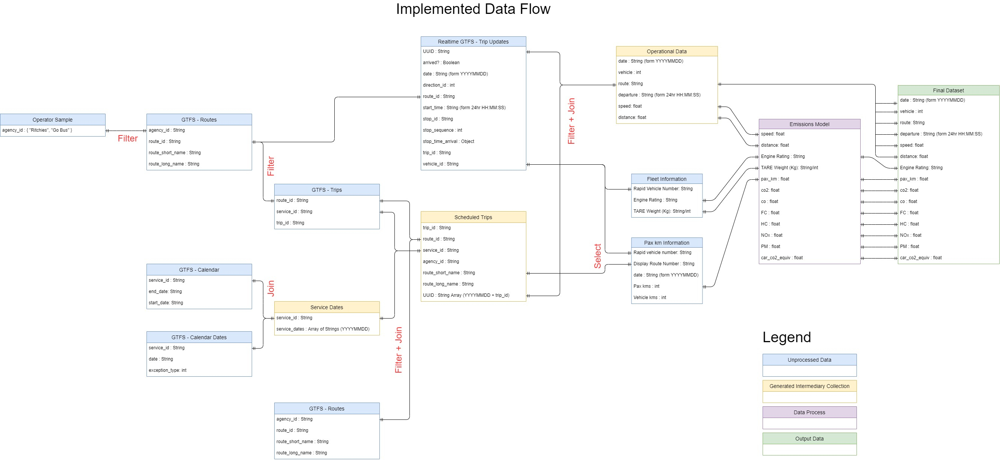
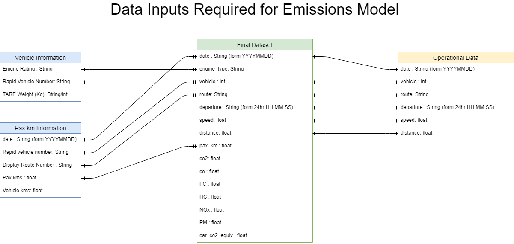
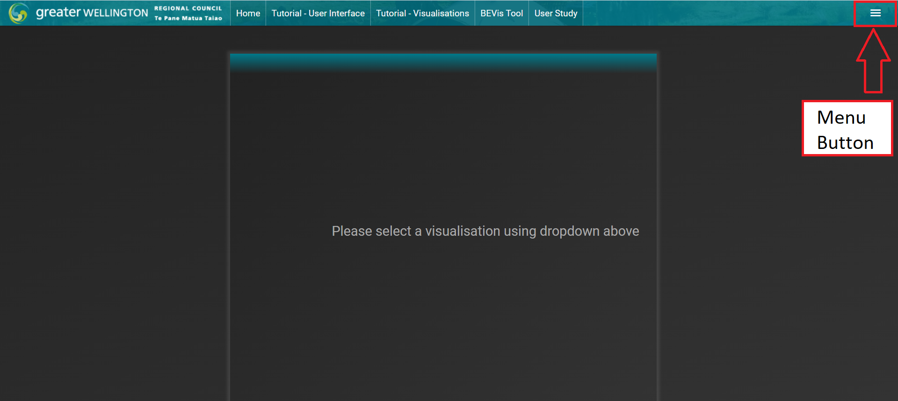
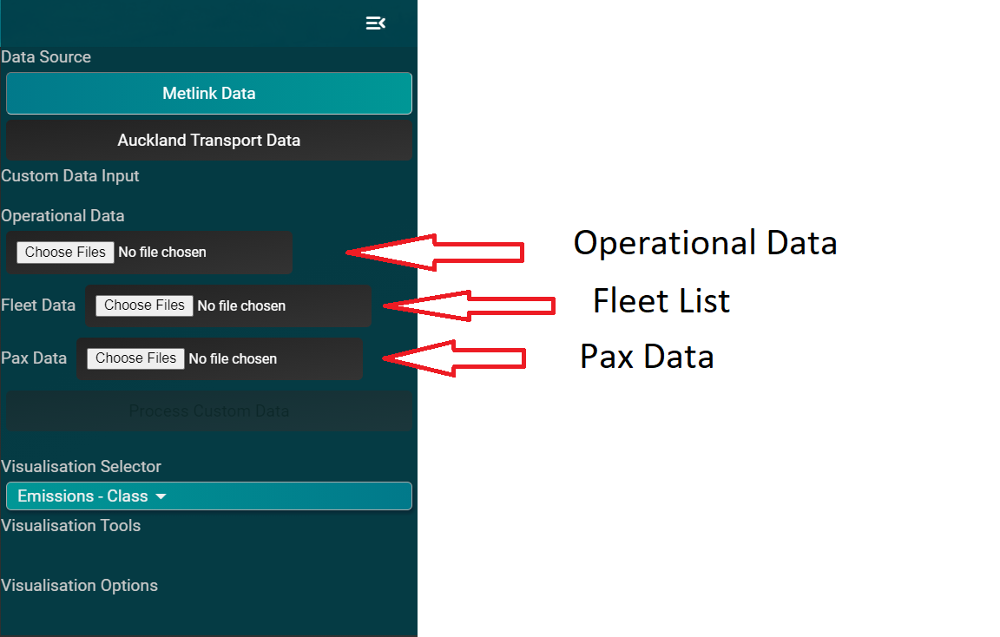
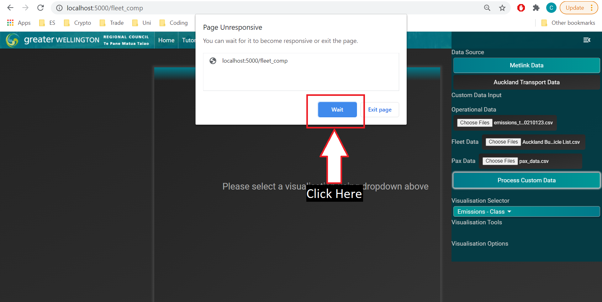
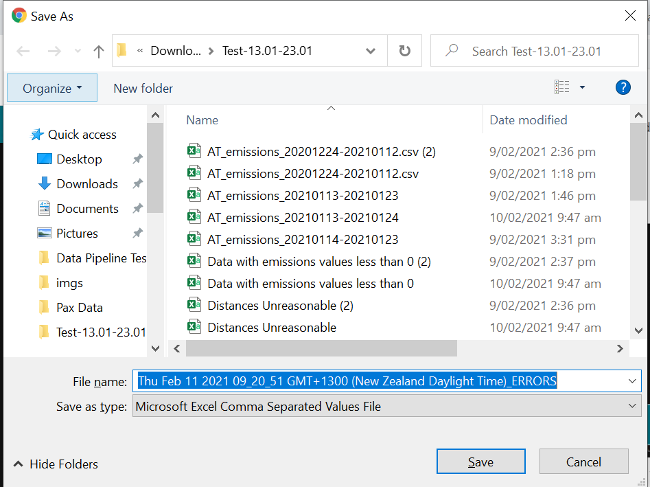

# AT Public Transport Emissions Analysis - Proof of Concept

## Table of Contents

- Abstract
- Background and Purpose
- Definitions
- Methodology
  - The Data Pipeline
  - Data Sources
  - The Data Specification
  - Setting Up The Pipeline
  - Using The Data Filtering Implementation
  - Acquiring Data
  - Importing Necessary Data
- Implementation
  - Data Storage & Access
  - Data Collation within the Model
  - Implementation of Emission Impossible's Emission Calculations
- Assumptions and Interpolation
  - Missing Information
  - Scheduled Trip Distances
  - Passenger Km
  - Emissions Model
- Outputs and Visualisations of the Analysis Tool
  - Datasets Produced
- Recommendations for Future Analysis
- Conclusions

## Abstract

- To be completed

## Background and Purpose

- Outline the Stakeholders involved in this work (i.e. NZTA & AT)
- Outline the motivation and benefit for public bus emissions to be estimated using a software-driven approach
- Declare the intent to use the model already developed by generating the required inputs from provided data
- Outline the broad limitations of the approach (i.e. categories of assumptions)

**Draft**

There is currently a national drive to reduce emissions as a measure of mitigating human-induced climate change. Within the transport sector, public transport is an important method of reducing the emissions of the transport network as a whole. The majority of buses on New Zealand public transport networks are diesel. Therefore, improving national and regional understanding of the emissions of buses on the public transport network can assist with planning and decision-making at a high level to meet emission reduction goals.

The most accurate methodology to estimate emission quantities is to examine fuel consumption of the buses on a public transport network. However, this approach has several limitations. These include: 

- Buses on the network are typically used for other purposes (e.g. private charters, rail replacements, special services). The emissions generated by these activities are not attributable to the public bus network.
- Fuel consumption data can be commercially sensitive under certain contractual frameworks.
- This data is not typically collected centrally by the public organisation operating the entire network.

As a result, a software-based approach using network operation data in conjunction with formulae from the European Union EMEP/EEA air pollutant emission inventory guidebook may be more suitable. This approach is likely to be easier to implement and roll out at a large scale while maintaining acceptable levels of accuracy. 

A successful trial was undertaken by GWRC and VUW in 2019 to use a software-based approach to calculate the present and historical emissions of the public transport bus fleet across the Wellington region. As a result of this trial, NZTA Waka Kotahi has requested a proof-of-concept study to examine whether this model can be applied to the Auckland region. This work was undertaken in collaboration with Victoria University of Wellington and supervised by Chris Vallyon.

This pilot study will examine the emissions generated by two bus operators on the Auckland network, Go Bus and Ritchies. Collectively, they service approximately a third of the trips across the Auckland bus network. Auckland Transport manages the public transport network across Auckland. They will provide the operational data that will be processed into the inputs for the emissions model. The emissions model then uses these inputs to generate an estimate of the emissions generated by each bus on a given trip instance. The output from the model can then be aggregated upwards to provide an estimate for the emissions generated by a given vehicle, a given route, or over the entire network.

This report will outline the methodology used to produce this model. In the instance where provided data may be incomplete or limited, any assumptions and interpolations required in order to generate a complete model will be described. 

## Definitions

**Deployed Application** - The live version of our research tools hosted on external servers. These applications are accessible through the web.  
**Local Application** - A local application is an application run on your own machine. The local application requires a running environment (outlined in the setup/requirements section) and the code base to be on your computer.  
**Trip** - A sequence of two or more stops scheduled to be completed at a specific time on a route, repeated across days.  
**Trip Instance** - The completion of a trip by a vehicle on a specific date.  
**Route** - A route is a group of trips that are considered a part of the same service. They are displayed to passengers under a single name/code.  
**Service** - A service is a set of dates that a given trip operates on.  
**UUID** - Universal Unique Identifier.   

## Methodology

The methodology used to apply the model to the Auckland context can be separated into the following steps:

1. Procurement of raw operational data from the AT API, vehicle information from AT (as at Dec 2020), and passenger kilometer data.
2. Processing and filtering this data to our sample for the study. The two providers (Ritchies and GoBus) were selected as they provided TARE Weights for their vehicles. We form the operational data to match our data specification, and perform sanity checks on data (missing schedule trips, real time observations, etc). This step is referred to as **preprocessing**.
3. Building a software pipeline using a combination of a database backend (we have experimented with MySQL, PostgreSQL and implemented in MongoDB), a backend technology (we have used Nodejs to implement the *preprocessing step* described above, and Python to implement the backend for the online application) and a frontend to interact with the pipeline.
4. Finally, we reproduced this pipeline in a deployed application allowing processing of correctly formatted data automatically. We used a previously developed Emissions visualisation tool to visualise large scale emissions based on the processed operational data.  

The aim of the first step is to collate and generate several data fields for each trip in the analysed dataset. We defined a trip instance as a sequence of two or more stops undertaken by a specific vehicle on a specific time and date. A database schema with the required fields and formats for the model developed is included in section **reference Data specification section**.

### The Data Pipeline

There are two categories of data used within this model. It should be noted that both types of necessary for the model to work correctly and provide comprehensible outputs.

The data inputs to the emissions model are as follows:

- EURO classification of the engine of the vehicle that carried out the trip.
- Average speed (in kmh) of the vehicle over the entire trip.
- The distance of the trip in km.
- Tare weight (in kg) of the vehicle that carried out the trip.
- Passenger loading represented by the total distance travelled by individual passengers on the trip in km.

The data fields that assist with filtering and visualisation are:

- Date the trip occurred on.
- The departure time of the vehicle from the first stop on the route.
- The name of the route that the trip services.
- The vehicle ID number that identifies the vehicle that carried out the trip within the operator's fleet list.

The emissions model was developed during the Wellington trial and reused on the Auckland bus operational data. This model is based on formulae from the European Union EMEP/EEA air pollutant emission inventory guidebook and NZTA data on the NZ personal vehicle fleet **references?**. The model estimates the following quantities for each trip:

- Fuel consumed in liters.
- The carbon dioxide equivalent (CO2-equiv) generated in kg. This is the sum of CO2 and the CO2 equivalent of other greenhouse gases (methane & nitrous oxide) produced by the combustion of diesel and engine lubricants.
- The quantities of each of the non-CO2 greenhouse gases (methane and nitrous oxide) produced in kg.
- The quantities of pollutant gases (carbon monoxide, nitrogen oxides, hydrocarbons, and airborne particulate matter) produced in kg. These gases have a detrimental environmental and health impact in the environment they are emitted in.
- The CO2-equivalent generated if each passenger had instead travelled in an average personal car as the sole occupant. This is intended as an estimate for the carbon cost of not running a given trip.

A summary diagram showing the process of building our model for this study is below is shown below. The learnings from this exercise led to the development of the data specification in **TODO ref section Data Specification**.

The outputs from the model are visualised in a tool called "BEVis" that is a research tool was developed as an extension of the Wellington trial. These visualisations are displayed later in the report.

The rest of this section will describe the implementation of this methodology that we developed and utilised over the course of this study.

### Data Sources

Most of the data used for our study was retrieved from the AT developer's portal API. GTFS and real-time data was utilised to generate a complete dataset of scheduled and observed trips. The following schedule data was retrieved from several of the GTFS APIs:

API Endpoint | Data Field | Data Type | Description 
--- | --- | --- | ---
Trips | trip_id | String | Unique identifier for the scheduled trip. 
Trips | route_id | String | Unique identifier for the route the trip services.
Trips | service_id | String | Unique identifier for the service schedule the trip operates. 
Routes | route_id | String | As above - Used to join data from different API endpoints.
Routes | route_short_name | String | The short name of the route the trip serviced.
Routes | agency_id | String | The code for the bus operator that operates a given route.
Calendar | service_id | String | As above - Used to join data from different API endpoints.
Calendar | start_date | String | The date that a service schedule begins operating.
Calendar | end_date | String | The date that a service schedule stops operating.
Calendar | [Weekday-name] | boolean | A field for each day of the week with a boolean (1 or 0) indicating whether the service operates on that day.
CalendarDate | service_id | String | As above - Used to join data from different API endpoints.
CalendarDate | date | String | The date that an exception to the regular service schedule occurs.
CalendarDate | exception_type | integer | The type of exception that occurs. E.g. whether a service runs when it would not be regularly scheduled or vice versa.

 The following data was retrieved from the real-time trip updates API:

Data Field | Data Type | Description 
--- | --- | ---
trip_id | String | Unique identifier for the scheduled trip. 
date | String | The date that a given trip occurred.
arrived? | Boolean | Boolean indicating whether a trip is recorded as completed (arrived at the final stop in the sequence).
start_time | String | The time that the trip began.
stop_time_arrival | int | The most recent stop time for the bus on the trip. This value is provided as an epoch timestamp.
vehicle_id | String | The "Rapid Vehicle Number" uniquely identifies a vehicle within the entire Auckland bus fleet.

 This data has been collected since 14/12/2020 until 05/02/2021. Starting from 23/12/2020 until 24/01/2021, the dataset is complete (with the exception of downtime, discussed later). **Outside of this range the dataset may be incomplete.**

In addition to the data publicly available via the Developer's Portal, two further sets of data were received directly from Auckland Transport. They are the Auckland Bus Operator fleet list and passenger km (pax_km) data. The fleet list contained the following data relevant to the study:

Data Field | Description 
--- | ---
Rapid Vehicle Number | The "Rapid Vehicle Number" that uniquely identifies a vehicle within the entire Auckland bus fleet.
agency_id | The code identifying the vehicle's operator.
Engine Rating | The EURO classification of the vehicle's engine.*
TARE Weight (Kg) | The weight of the unloaded bus in kg.

 The pax_km data passenger km and vehicle distance data for the date range of 12/24/2020 through to 30/12/2020. The data provided was aggregated to contain values for a given vehicle on a given route over the entire date range. The relevant data fields are shown below:

Data Field | Description 
--- | ---
Rapid vehicle number | The number that uniquely identifies a vehicle within the entire Auckland bus fleet.
Display Route Number | A short numeric code that represents the route. This code corresponds to the "route_short_name" from the Routes GTFS API endpoint.
Vehicle trips | The number of trips completed by the vehicle on the route over the specified date range.
Vehicle kms | The total distance travelled by the vehicle on the route over the specified date range.
Pax kms | The total distance travelled by passengers on the vehicle on the route over the specified date range.

 

### The Data Specification

The data specification is a data model describing the required format for input data in our application. There are three data sources:

- Operational Data
- Vehicle Data
- Pax Data

The specifications for each dataset are **_exactly_** as described in the tables and diagram above. The files must be a csv format, with no commas in any of the string values. Json data is not accepted, for example. The units are descibed below.

**Operational Data**  
Data Field | Units | Format
--- | --- | --- 
date | days | String: YYYYMMDD
vehicle | - | String
route | - | String
departure | - | 24hr HH:MM:SS
speed | - | kmp/h
distance | - | km

A sample of the processed operational data from our exercise is below:

**Vehicle Data**
Data Fields | Units | Format
--- | --- | --- |
Engine Rating | String | must be one of: 'PRE-EURO', 'EURO1', 'EURO2', 'EURO3', 'EURO4', 'EURO5', 'EURO6', 'EV', or 'ELECTRIC'
Rapid Vehicle Number | - | String
TARE Weight (Kg) | kg | String

 Below is a sample of vehicle data from our data for this project:

**Pax Km Information**
Data Fields | Units | Format
--- | --- | --- 
date | - | String: YYYYMMDD
Rapid vehicle number | - | String
Display Route Number | - | String
Pax kms | Passenger / km | int
Vehicle kms | km | int

 Below is a sample from our data for this project:

Mode |	Year |	Month	| Display Route Number |	PTOM vehicle type |	Rapid vehicle number |	Vehicle trips |	Vehicle kms |	Pax	Pax kms
 --- | --- | --- | --- | --- | --- | --- | --- | --- 
Bus |	2020 |	12 |	101 |	LB-D |	14011 |	1 |	19.576 |	2 |	7.255
Bus |	2020 |	12 |	101 |	LB-D |	14041 |	1 |	20.058 |	3 |	10.149
Bus |	2020 |	12 |	101 |	LB-D |	14049 |	1 |	19.576 |	2 |	10.337
Bus |	2020 |	12 |	101 |	LB-D |	14053 |	2 |	30.087 |	4	| 14.59

 This data specification has been used to implement the pipeline on a deployed application. The use of this deployed application is described in **TODO reference use of the tool section**.

### Setting Up The Pipeline

**Note** There is a fundamental limitation to both of the projects. We are limited by the available fleet information, and therefore to extend any of the tools developed here for **more service operators** the tools will need to be changed.

**Local Project**

The local project still works on local machines, however the db is always going to be the MongoAtlas database setup for the original project. If you need to change anything about the db, please email Chris Todd at chriswilltodd@gmail.com.

**Requirements**

Python >= 3.8

The codebase for the deployed pipeline is available through git.
1. Download git.
2. Open git, and navigate to your desired directory.
3. enter the command `git clone https://github.com/chriswtodd/BEVis.git`

**First time python Setup:**

Install the required python libraries:
    
    pip install requirements.txt

Start the local development server on localhost

    python app.py

The website will start on http://localhost:5000/fleet_view

The local application is used in the same way as the Deployed Application.

 

**Deployed application**

The deployed application is available at: https://warm-temple-67996.herokuapp.com/fleet_view

To process data on the version of the tool you are running:

1. Open the control window using the menu button in the top right corner.

2. Select your dataset. 
    - Datasets "Metlink Data" and "Auckland Transport Data" are preprocessed; you can use the visualisations immediately.
    - Custom data can be loaded into the tool and the tool will attempt to create the data needed, which then can be used in the visualisations.
3. If you wish to use custom data:
  - Load operational data in the first load file selector.
  - Fleet List data is loaded in the second file selector.
  - Pax List data is loaded in the third file selector.
  - Press the "Process Custom Data" button, and wait. 
  - *Please be patient*. If the window says it is unresponsive, select *keep waiting*. It will eventually finish. The browser will give you an alert when the pipeline is finished. Only then can you use the tool again.

4. When the pipeline is finished, a download window will open. There are 9 files in total, each a collection of potential errors or gaps in your dataset.

5. Select a visualisation using the dropdown at the bottom of the right side menu.

6. Once the request is completed loading, you can interact with the data.

**Please note**: In order to use the data pipeline correctly please ensure your headers are correct, ie they exactly match the specification in section **TODO reference Data Specification section**.
Please be aware of the explicit use of chars such as ‘ ’, ‘_’, and case sensitivity. A space at the end of titles for example, or an enter that is accidentally put in a cell, is enough to cause issues. If headers do not match, the pipeline cannot work.

### Using The Data Filtering Implementation

The data filtering implementation is a separate process to emissions calculations, as discussed in **TODO reference methodology section**. This is the process of taking raw data from operators, governing bodies etc and processing it to match the data specification in the **TODO reference the data specification section**.

For our project, we implemented a Nodejs application to preprocess the data. Node was chosen as a simple way to support the application with a backend. Since we were using JS on the front end, removing the Python stack (as is present in the deployed application) removes some of the overhead needed to develop on our code base. Nodejs provides convienent libraries for experimentation with SQL and MongoDB technologies, and an API building library `express.js`.

The repo contains the code used to scrape data from the Auckland Transport API, and join this data with other data to create a single model of a sample of the bus operations on the Auckland Transport network between Dec 2020-Jan 2021. This formed the operational data for the emissions calculation model described above.

**Requirements**

The codebase for the preprocessing pipeline is available through git.
1. Download git.
2. Open git, and navigate to your desired directory.
3. enter the command `git clone https://github.com/chriswtodd/ATE.git`

Nodejs is used as the runtime environment for the program so this must be installed.

Nodejs is available for download [here](https://nodejs.org/en/download/).

Installation and Running:
<ol>
    <li>  In a console, navigate to `YourInstallationDirectory/ATE` </li>
    <li>  Enter `npm install package.json` 
          This will install all the necessary packages for our program </li>
    <li>  In the console, while still located in `/ATE` folder, type `node views/app.js` </li>
    <li>  Navigate to `localhost:3000` to interact with the server now running on your machine. </li>
</ol>

Consult the readme available at "https://github.com/chriswtodd/ATE" for full instructions on use. A quick start guide is provided below.

**Quick Start Guide**

**Note** The csv produced by this pipeline has a JSON object, and that column (realtime_observation) must be removed if you wish to use this data in the deployed application.

Our data pipeline is an implementation for us to show one way to completely generate the emissions of a given dataset. This serves as both the preprocessor and the processor (clean and join datasets to form Operational Dataset, and use Pax data with Fleet data to generate the emissions.)

Aquiring data, and calling endpoints until `/join_routes_to_final` serve as preprocessing. `/join_pax_km` and `/calculate_emissions` perform the emissions calculating step.

Be aware you may change the connection object via `const client = new MongoClient(config.mongodb.uri, { useUnifiedTopology: true });` OR changing var `config.mongodb.uri` to your connection object.

### Acquiring Data

**Realtime Data**

The script `realtimeScript\RealtimeScript.js` must be run continuously to create the necessary data from the AT API. This can be deployed on a local machine and left running, however this is vulnerable to power failures. It was previously run inside a screen env on a server master node for ~2months with approx ~24hrs downtime.

The subscription key can be changed with the var at the top (search for "let key").

**Schedule Data**

The script `models\scheduleConfiguration.js` can be run once everytime the schedule changes.

**_NOTE_** If the current datasets are between generation and the schedule changes (ie we once had trips scheduled for 24.01 but it change on 21.01) please run the `/repair_database` endpoint to fix the dataset before generating the next.

### Importing Necessary Data

Data can be collected using the API Scripts, or placed into a database. Please be careful with your database objects and ensure that your database names, urls etc all match.

Once you have the data needed, the scripts will auto load the data for you, or data can be inserted using the mongoimport tool (Windows dist here: https://docs.mongodb.com/database-tools/installation/installation-windows/). Heres an example of the import urls for our datasets:

`mongoimport --db teste --jsonArray --collection calendar --drop --file "calendar.json"
mongoimport --db teste --jsonArray --collection calendarDate --drop --file "calendarDate.json"
mongoimport --db teste --collection realtime_raw --drop --file "realtime_raw.json"
mongoimport --db teste --jsonArray --collection routes --drop --file "routes.json"
mongoimport --db teste --jsonArray --collection trips --drop --file "trips.json"
mongoimport --db teste --jsonArray --collection versions --drop --file "versions.json"`

**_NOTE_** There is no connection URL in these imports so mongoimport will import these to a local db. Please ensure that your db connection objects are consistent across files, and match the db you import these collections to.

The vehicle fleet list is currently implemented in the pipeline on the deployed app as a static file that must be loaded into the tool on a one off basis. It is required to follow the data specification in **TODO insert ref here**. If there is an issue with the dataset, the pipeline can warn you about errors related to headers being incorrect, vehicle TARE Weights being unreasonable (>100000kg, or 100 Tonnes), and vehicles with invalid engine types (the valid list of engine types is included in section **TODO**). 

The main endpoints to generate the necessary dataset are:
- `/generate_schedule`
- `/join_raw_routes_to_final`
- `/join_pax_km`
- `/calculate_emissions` 

In order to use these end points, we need the schedule information in the format specified, and the raw information placed into the same MongoDB Database. 

The connection object within `views\app.js` at the top must be changed to suit your connection to your database. It currently looks like `const client = new MongoClient(config.testing.uri, { useUnifiedTopology: true });`, prehaps with a different first arg (the connection uri). The db object (search for "let dbo") must also be changed to the correct collection for your data.

The pipeline has some dependancies on hardcoded dates, this is mainly due to time constraints. Please change the hard coded dates in the four endpoints above to suit your dataset, otherwise the pipeline will not work.

Finally, calling these 4 endpoints above in order will generate the completed dataset.

##### Developing the preprocessing pipeline

This preprocessing pipeline has potential to be reused for several datasets, all produced from the AT developers API.

Firstly, we must run the scheduleConfigure.js script. This will give the GTFS information as specified in **TODO reference Our Data Sources Section** above. This script could be automated in the future. One issue that would be faced is how to go about repairing the database. Care needs to be taken to regenerate the sets of correct UUIDs after an unexpected schedule change.

Another issue that will need to be fixed is the main four endpoints reliance on hard coded dates. There are atleast **eight** instances of hard coded values. In /generate_schedule, the date filtering range should be changed, around line 546. This is the same as the calendarDate date field matches, around line 634, 658/659. In join_raw_routes_to_final, the date objects need to be changed on line 1348. On line 1372/1373 the value at the end of the conditional '$and' needs to be changed to the correct dates. Finally, on line 1485, the dates for the match need to be changed.

As it stands, the code is not yet developed enough to be able to handle these edge cases, however could be considered going forward for similar data cleaning exercises. Other additions to improve this pipeline include data filtering options provided on the front end, interactive error messages and automated data cleaning (detect dates in the wrong format and correct them, for example). 

## Implementation

### Data Storage & Access

Managing a dataset of this size and complexity requires careful consideration. Our chosen approach is to use a database instance to house the data, and a software tool to facilitate use of the data. Database technologies considered for this study were: MySQL & MongoDB.  
MySQL was considered as it is an implementation of SQL. SQL in conjunction with a relational database is the most popular database management system, particularly for large-scale enterprise contexts. This option was not pursued as even if we did use a SQL technology to implement the database, we believe the cost of writing queries would become a bottleneck in the future without good support in the technology for data warehouse analysis.  
PostgreSQL is another SQL specification tech. This was considered because of the data warehousing methods provided. PostgreSQL required paid hosting as well, and so we did not use this for our implementation.   
MongoDB is a NoSQL database management system and the most popular NoSQL database available. It is widely used in several contexts although typically not in legacy systems or contexts where data integrity must be maintained (e.g. healthcare & finance).

Although SQL would more closely relate to the database systems currently in use by transport agencies, MongoDB was selected for use in this project. This was primarily due to the higher quality free option available and pre-existing skillsets allowing for greater progress to be made during the short timeframe of the project. 

The suite of functions and tools provided by MongoDB is similar to the level of PostgreSQL as well, so we have access to powerful data aggregation and manipulation functions. This makes it well suited to web application development.

### Data Collation within the Model 

**Note** The following section outlines how the inputs to the emissions model were derived from the data sources (outlined above) within the context of a proof of concept. As there are multiple data sources with several different unique identifiers this process was relatively complex. We believe the large scale implementation of this method would not scale appropriately to the dataset. However, it is included here as an example of the preprocessing that is required on datasets to form them to our specification.

We collected data using automated scripts. The realtime script, responsible for requesting API information every 30s was hosted on VUW's main node of their dedicated server (the "barretts" machine). The real-time data was posted directly to MongoAtlas, a live deployed implementation of a clustered MongoDB database in a single collection.

The real-time trip instances were joined to the GTFS routes collection using the *route_id*. Then, they were filtered to the relevant operators using the *agency_id* in the GTFS routes data. This produces a collection of observed trip instances by Ritchies & Go Bus. These trip instances contained:

- Date
- Vehicle ID
- Route name
- Trip start time
- Trip duration - Derived from the start and end times present in each trip instance

The trip instances can be uniquely identified using a concatenation of the date the trip instance occurred and its trip_id (as shown below). This unique identifier was applied to each trip instance in the real-time data.

 Unique Trip Instance Identifier format - <b>[Date]_[Trip_id]</b>

The vehicle data is joined to each trip instance using the *vehicle_id*. This provides each trip instance with the tare weight and the EURO rating of the vehicle that served it. 

The final data to create the required datasets is the distance and pax_km data. The provided data was aggregated to the route-vehicle level; i.e. the data contained the distance travelled by a particular vehicle on a particular route over the reviewed time period. As the emissions model operates on trip instances, this required some assumptions about how to apply the distance and pax_km values to individual trip instances. Distance is based on the average distance travelled on a route across all vehicles. Pax_km is based on the average distance travelled per route, *per bus*. A summary processing pax_km is:

- Identify the *vehicle_id* and the *route_short_name* for each real-time trip instance.
- Use these two values to identify the corresponding entry in the pax_km data.
- Calculate the average pax_km per trip by dividing the total pax_km by the *Vehicle trips* field. The average pax_km are then assigned to the relevant trip instance.

There appears to be distance discrepancies, and errors introduced by leading 0 issues. There appears to be only a single route that is missing distance information with our current technique (32 total trips), however being unable to access AT’s data extraction method we have no way of knowing they are not accidentally aggregating their data incorrectly. Some examples include routes 031 by RTH and 31 by GBT, or 75 by GBT and 075 by NZB. This appears to be an issue stemming from the route table on the developer API (this API provided the routes with leading zeros which were indicated to be school services **Chris V - refer to your emails**).

The assumptions and resulting consequences inherent in this process are detailed further in the next section of the report.  
Each trip instance now has the required data for the emissions model to estimate the generated emissions for each trip instance. A diagram of the full procedure is included below.

**TODO Insert diagram!**

### Implementation of Emission Impossible's Emission Calculations

**TODO insert updated version of methodology included in GWRC report**
- Language will need to be updated to use trip instance rather than trip etc.

## Assumptions and Interpolations

**Important section**

- Outline the assumptions made when forming the model inputs from the data
- Outline the assumptions inherent the model already (e.g. emissions calculated at the trip level based on average speed)
- Outline the assumptions around passenger loading and the impacts of it on the model
- Present results of comparison to real fuel consumption data (**if we receive the data**)

### Missing Information

We have identified several types of missing information within our dataset. The first dataset runs from 20201224-20210113 and contains a total of ~86000 trip instances. The table below outlines the missing data identified; the quantity of data missing; the implications of the missing data; and any assumptions made to work around the missing data.

Missing data | Number of trip instances affected in full set / 86000 (& in 24/12 - 30/12 date range) | Implications | Solution
--- | --- | --- | ---
Vehicle information | 5849 (0) | We cannot assign a vehicle number to the trip, therefore we cannot assign a EURO class to the trip instance. | Interpolate the trips without info by assigning EURO classes at the same proportion to the missing trips as those present in the data.
Real time measurement | 5849 (0) | This means that this trip should have occurred according to our formed schedule, but was not in the real time dataset. | Ignore this, as we are focusing on observed trips. If there is no trip observed we assume for some reason it was cancelled.
Missing from schedule | 6 (0) | This trip occurred and we have a real time observation for it, however it is not in the schedule. It will be missing a scheduled start time. | Using trip_id we are able to match these trips to other similar trips in the schedule, and use those start_times.
Any stop information | 49 (0) | This trip was both in the schedule and the real time, however it does not record any stop information. This means we cannot calculate the speed of the bus. | Assume no stop information is present due to the trip instance being cancelled. We cannot do anything with this observation.
Final stop information | 7302 (0) | This trip was not recorded finishing its journey. This can be an issue with missing stops, finishing early, or geofencing. | Assume that every trip with recorded stop information completes the entire trip. It may be possible to determine incomplete trip distances. However, the probability of an incomplete trip is very low relative to number of recorded incomplete trips. This results in time measurements being slightly underestimated. However, we know this is not a huge issue, as average speeds are still reasonable (as observed in the output visualisations). 

**Additional notes**  
In the generated dataset, missing real-time measurements were the **only** cause of missing vehicle information. As such, we did not need to interpolate missing vehicle information with this dataset. The suggested methodology used for the Wellington study is included for reference below.

Use observed trip instances in the existing data to generate a probability distribution of the EURO classes for a given trip. Then use a random number generator to assign a EURO class to the given trip instance. For example, if 70% of other trip instances were operated by a EURO3 class vehicle then there is a 70% chance that the random number generator would return a value that assigns a EURO3 to the trip instance without vehicle data.

Regarding the missing real-time information, the assumption was made that if it was not in the real-time trip updates data then the trip did not run for some reason. This introduces the posssibility that trips occurred but were not recorded. However, to remove this possibility we would need to assume all scheduled trips were operated and include them in the emissions total. As this model is based on observed trips rather than scheduled trips, this was deemed unnecessary. If the probability that a scheduled service did not run is lower than the probability of an unobserved trip occurring on the network then it would be worth considering changing the model to suit this scenario.  

### Data Source Selection  TODO - incorporate into methodology as a validity/reporting check and to generate the scheduled UUIDs

**Assumption** - The real-time data alone provides sufficiently complete operational data for the two operators examined.

**Explanation**  
The methodology outlined does not use scheduled data. However, a collection of scheduled trip instances was also generated to validate the completeness of the real-time data. The scheduled (GTFS) data was collected when a version change occurred. The general process to generate the scheduled trip instances is as follows:

- The trips are joined to the routes using the *route_id* and then filtered using the *agency_id* to identify the set of trips operated by providers of interest (Ritchies & Go Bus in our case). 
- The dates of the trips are added from the schedule using the *service_id*. The set of dates for a service is created by: getting the service days from the calendar collection; then adding/removing exceptions specified in *CalendarDates*.
- Each scheduled trip instance is assigned a universal unique identifier (UUID) with the same format mentioned previously.

The UUIDs were used to identify the proportion of scheduled trips that were observed in the real-time data. There were ~49/86000, or ~0.05% of scheduled trip instances not observed. Due to a lack of information regarding these trips the only reasonable assumption we can make is that they did not run.

### Scheduled Trip Distances

There are two available sources for distance data for the trips in the real-time data. These are:

- The distances included in the distance/pax_km data supplied by AT.
- Generated distances based on shape files available from GTFS API.

The latter option was initially used to generate distances for the real-time trips in the dataset. There is a GTFS endpoint on the AT API that returns the shape file (i.e. a list of coordinates) when queried with a *trip_id*. The process to calculate the distance was as follows:

- Find the distance between each sequential pair of coordinates in the shape file. The calculations were carried out using a geographical calculation library in JavaScript.
- Sum the distances between the coordinates to find the total distance of trip.
- Assign the distances to the real-time trips by *trip_id*.

Upon comparison with the supplied distances, it was found the AT distances were significantly larger than the distances generated from the shape files. **TODO insert how much larger on average the AT distances are.** As the pax_km values are linked to the distances supplied by AT, the supplied distances were used to estimate the emissions. This ensured consistency across analysis exercises, hence facilitates comparison.  
The distances generated from shape files may be relatively inaccurate. However, considering the magnitude of the difference between the two sets of distances it may be worth confirming the validity of the distance generation methodology used by AT. Some notable data points that seem invalid include an average trip distance for the NX1 of 11,000kms. 

### Passenger Km

Passenger km (pax_km) is the cumulative distance travelled by passengers on a particular trip instance and are an important part of the emissions model's analysis and visualisation. They have an impact on the quantity of emissions generated by increasing the weight of the vehicle. They also provide insight into the net emissions generated by a given trip instance (i.e. whether emissions were saved by running a particular bus service).

Pax_km is incorporated into the model by dividing pax_km by the trip distance to generate *ave_pax_loading*. Ave_pax_loading is the equivalent number of passengers that would've travelled on a vehicle for the entirety of the trip instance. This allows the average additional weight on the vehicle due to passenger loading to be calculated and used in the model. For reference, each passenger is assumed to be 80kg.

We received the distance and pax_km data aggregated to the route and vehicle level. The trip instance assignment of pax_km and distance outlined in the methodology inherently assumes that the each trip instance on a route travels the same distance and has the same average passenger loading. This is unlikely to be true, however a more precise approach cannot be achieved without additional data.

### Emissions Model

The following sub-section outlines the assumptions that are inherent in the underlying model that estimates the emissions.  

The model estimates the emissions per *trip instance* based on average speed and distance. This level of granularity results in the following factors being excluded from the analysis:

- **Variable road gradient, speed, and stop/dwell times over the course of a trip instance** - Road gradients and speed variation have a significant impact on emissions due to the additional energy required to travel up hills and accelerate. However, accurate real time data (including accelerometer and speed information) with sufficiently short intervals between data points would be required to carry out this level of analysis. At the time of the study, this data does not exist or was unavailable. The Emissions model also cannot currently accept this level of detail in the input data. Further review would be required prior to being updated to accept this additional data to ensure it remains aligned with the relevant EU standards.
- **Driver Behaviour** - Driver behaviour has a significant influence on emissions due to difference in frequency and intensity of the acceleration/deceleration of the bus. However, the operational data to carry out this analysis does not exist and this level of complexity is beyond the current scope of our analysis.
- **Environmental & Weather Conditions** - The ambient temperature and differences in traction due to weather variations could potentially make a marginal difference to the efficiency of an engine and its emissions. The study did not include a collation of historic meteorological data and nor were we able to source any information on how weather conditions might alter emissions. As a result, this additional level of complexity is beyond the current scope of our analysis.

The original Emissions Impossible model used contractual bus sizing to select the method for applying variations in weight to the emission factors. It was decided to use the weight factor equation shown in the previous section for all the buses in the fleet. The contractual sizing is occasionally not representative of the actual size of a given bus. Therefore, using the vehicle's tare weight combined with passenger loading provides a significantly more representative indication of the size and weight of a given bus. This introduces the assumption that emissions generated by a bus respond *linearly* to variations in gross vehicle weight. 

Dead running is a necessary part of operating a public bus network. There are regular occasions where buses need to be operated without passenger on-board such as, during repositioning and travelling to/from the depot. We have assumed that dead running amounts to ***15%*** of the distance travelled on scheduled services. This proportion was used for the Wellington study and likely requires updating for the Auckland context.

- Emissions offset (average vehicle - each passenger drove the distance in a single occupant vehicle)  
Generating the CO2-equivalent offset for a given trip instance assumes that each passenger would instead drive the same distance as the sole occupant in an average NZ car. I.e. the total pax_km distance is driven by an average NZ car. This is a relatively rough comparison, however it was deemed acceptable given the scope of the analysis. The "average" NZ car was found in a Ministry of TRansport report on the NZ Vehicle Fleet from 2017. The average fuel economy of the light petrol fleet in 2017 was estimated as 9.2 litres per 100km. The conversion factor between grams of CO2 per km is 

## Outputs and Visualisations of the Analysis Tool

- Images of the preliminary results generated by BEVis
- Brief description of outputs of the model

### Datasets Produced

## Recommendations for Future Analysis

**Assign each trip instance a Universal Unique Identifier (UUID)**  

If each trip instance is assigned a UUID when it is scheduled, this type of analysis is significantly easier. An easily accessible list of all scheduled trip instances allows the real-time observations to be cross-referenced to determine the following:
  - The number of scheduled trip instances not observed in the real time data. From this data, a likely cause for missing real-time data can be determined (e.g. cancelled trip instances or faulty real-time data collection).
  - The number of unscheduled services operated on the network.
*TODO How else does it make this sort of task easier? Reduces possibility of double counting trips?*

**Introduce nationwide data standards for operational bus data**  

A nationwide standard format for bus operations data would streamline the development of an enterprise solution for this model. As outlined in this report, the emissions model requires input data in a certain format. If the operational data format was standardised, this would reduce the amount of pre-processing required by the input data significantly. A standard format may also assist the developers in automatically identifying the completeness of the data set.  
It should be noted that formatting operational data to meet the standard will likely incur costs at the regional level. As such, it may be worth comparing the costs required to develop the enterprise solution with and without a data standard. It is the authors' opinion that introducing a data standard is likely to reduce costs overall. Firstly, the standard can be designed to be processed by pre-existing staff within the regional public transport operators. Utilising internal workforce is likely to be more economical than using contracted software developers to complete a similar task. Secondly, a national data standard would promote the development of software tools to meet business needs outside of emissions accounting.

**Identify data sources within the public transport sector that would benefit from standardisation**   

As public transport telemetry becomes more advanced and widespread, greater quantities of operational data will be collected by public transport operators. As referenced previously, data in a standard format is significantly easier to process and analyse. As a result, it may be worthwhile to identify developing data streams and produce a corresponding standard. Conforming data to a standard is relatively straightforward at the point of collection. The early implementation of a data standard will reduce the work required to process the data to meet this standard.  
Examples of upcoming data streams include: real-time movement data generated by on-board accelerometers and battery usage data from electric vehicles.

- UUIDs for trip instances - it would vastly improve your reporting and decrease time spent on data analysis tasks.
- Our work shows the value in creating a consistent data standard, and believe such will improve operations, reporting and future development going forward. In the context of this project, it would mean less cost in repeating this exercise across public transport operators.

**The Vehicle Fleet List**

The vehicle fleet list could be further improved, either within the research tool or the commercial tool. Within the research tool, one of the main limiting factors for a better implementation of the list was the limited database size. Assuming this is still an issue, a local file collection could be created and appended to each time that the vehicle list is updated or changed. This approach is limited by the size of the files, and as the collection grows the time taken to run the pipeline will grow exponentially due to the limited handling functions provided by JavaScript (our front end tech). A solution to this would be using a database.

Using a database would scale well to include all the vehicle fleets in the country. This also means that the overhead of having files, and separating vehicle fleets can be simplified by introducing tables (or collections in MongoDB). The disadvantage is the maintainance and infrastructure required to run a database.  

**Other Recommendations**

We are using a database centric approach, and being advised by a relatively new industry professional. DBs were the best middle ground solution we have found. Due to the interest in front end processing and other similar functions which will be difficult in my view to extend further than what is already implemented (the calculation pipeline is already O(n^2) and generally very slow, hence the exponential slow down). I believe perhaps creating a dedicated application in a different technology may offer another solution. Using C as an example, a skilled C developer could make a similar application that instead of running in a browser runs as a dedicated application that can be installed. This means that the app will run faster, and certainly will process data on the local machine faster, however you may have issues hosting it on the web, and supporting the application moving forward.

Databases and hosted solutions are difficult to use for free. They are however cheap. We are already pushing the limits of free subscriptions to db tech such as MongoAtlas. Our projects currently hold ~1GB of data across 2 different dbs hosted in an AWS data warehouse in Sydney, with a limited bandwidth and a shared distributed cluster. The distributed cluster is due to the free tier we are using, and means the infrastructure powering our db is shared with others. At scale, this will obviously be problematic. The data size is one of the reason the vehicle fleet list is not implemented as described above.

## Conclusions

- To be completed